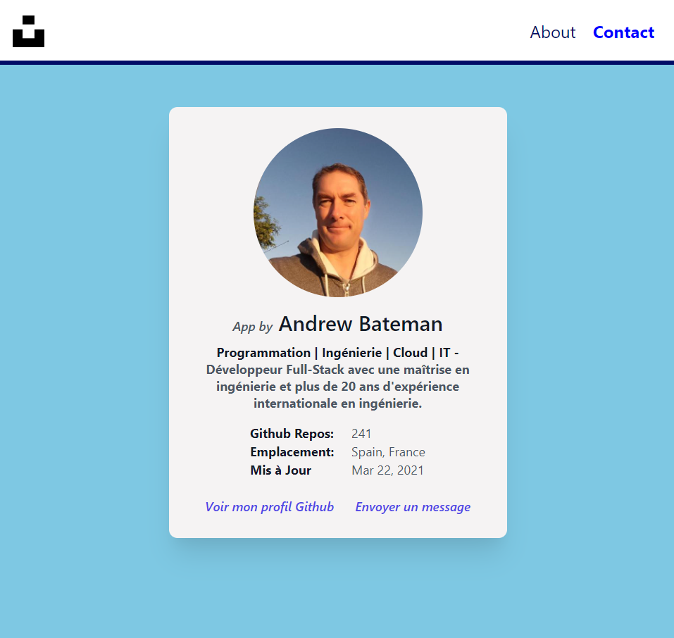

# :zap: Angular Unsplash API

* Angular 11 dev app that displays a random photo from the [Unsplash Developers](https://unsplash.com/developers) API.

*** Note: to open web links in a new window use: _ctrl+click on link_**

## :page_facing_up: Table of contents

* [:zap: Angular Unsplash API](#zap-angular-unsplash-api)
  * [:page_facing_up: Table of contents](#page_facing_up-table-of-contents)
  * [:books: General info](#books-general-info)
  * [:camera: Screenshots](#camera-screenshots)
  * [:signal_strength: Technologies](#signal_strength-technologies)
  * [:floppy_disk: Setup](#floppy_disk-setup)
  * [:computer: Code Examples](#computer-code-examples)
  * [:cool: Features](#cool-features)
  * [:clipboard: Status & To-Do List](#clipboard-status--to-do-list)
  * [:clap: Inspiration](#clap-inspiration)
  * [:envelope: Contact](#envelope-contact)

## :books: General info

* Uses rxjs pluck method to get just one photo url from the API response.

## :camera: Screenshots

.

## :signal_strength: Technologies

* [Angular v11](https://angular.io/)
* [Angular HttpClient](https://angular.io/guide/http) module used to communicate with back-end services via the XMLHttpRequest browser interface.
* [RxJS Library v6](https://angular.io/guide/rx-library) used to [subscribe](http://reactivex.io/documentation/operators/subscribe.html) to the API data [observables](http://reactivex.io/documentation/observable.html).
* [Angular Material Design v11](https://material.angular.io/) - [mat-card](https://material.angular.io/components/card/overview).

## :floppy_disk: Setup

* Run `npm i` to install dependencies.
* Run `ng serve` for a dev server. Navigate to `http://localhost:4200/`. The app does automatically reload if you change any of the source files.
* Run `ng build --prod` to create build files in `docs` folder. These will be deployed to github-pages. You need to copy the `index.html` file in the `docs` folder and paste it the same folder with a new name of `404.html`.

## :computer: Code Examples

* extract from `` to tba.

```typescript

  // function to get ...


```

## :cool: Features

* Angular httpClient used to get data from an API.

## :clipboard: Status & To-Do List

* Status: Working but not complete
* To-Do: Add API photo data to mat-card

## :clap: Inspiration

* [Unsplash](https://unsplash.com/) - source of free images

## :envelope: Contact

* Repo created by [ABateman](https://www.andrewbateman.org) - you are welcome to [send me a message](https://andrewbateman.org/contact)
