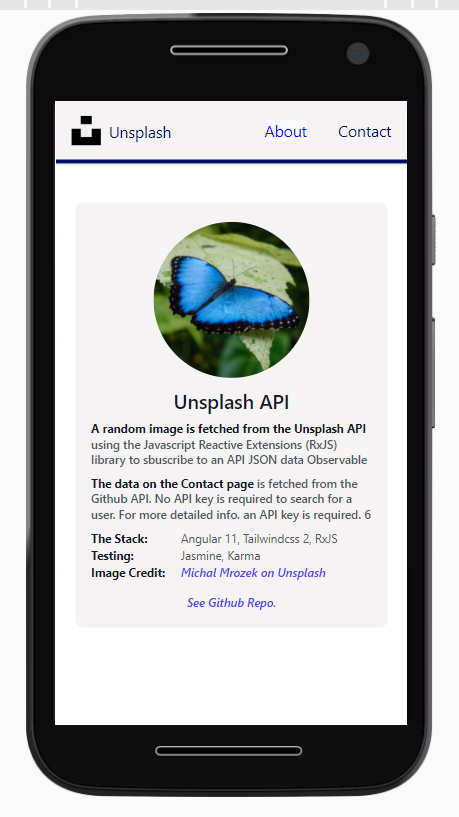
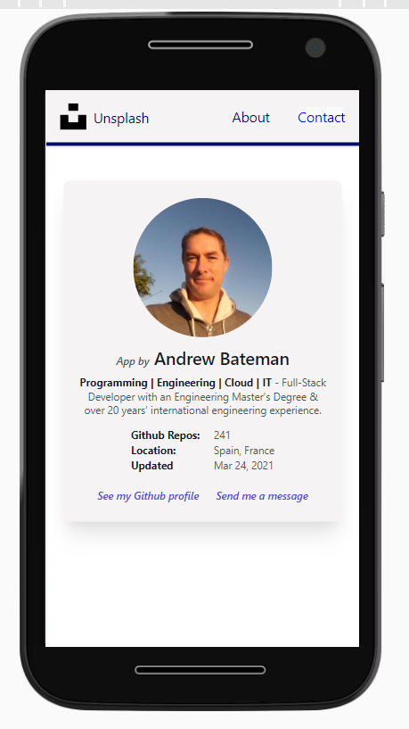

# :zap: Angular Tailwind Unsplash

* Angular app using [TailwindCSS](https://developers.google.com/chart/) components to display images from the [Unsplash Images API](https://unsplash.com/developer)
* **Note:** to open web links in a new window use: _ctrl+click on link_


## :page_facing_up: Table of contents

* [:zap: Angular Tailwind Unsplash](#zap-angular-tailwind-unsplash)
  * [:page\_facing\_up: Table of contents](#page_facing_up-table-of-contents)
  * [:books: General info](#books-general-info)
  * [:camera: Screenshots](#camera-screenshots)
  * [:signal\_strength: Technologies](#signal_strength-technologies)
  * [:floppy\_disk: Setup](#floppy_disk-setup)
  * [:wrench: Testing](#wrench-testing)
  * [:computer: Code Examples](#computer-code-examples)
  * [:cool: Features](#cool-features)
  * [:clipboard: Status \& To-Do List](#clipboard-status--to-do-list)
  * [:clap: Inspiration](#clap-inspiration)
  * [:file\_folder: License](#file_folder-license)
  * [:envelope: Contact](#envelope-contact)

## :books: General info

* About and Contact pages give more information on app using Tailwind CSS cards
* To build for production Tailwind’s purge option is used to tree-shake unused styles and optimize final build size.
* [RxJS take(1) operater](https://advancedweb.hu/rxjs-the-differences-between-first-take-1-and-single/) used to take first element from the Unsplash & Github observable streams then close them, so unsubscribing is not necessary.
* The Github basic user info API does not require an API key. The Unsplash API does.
* [Angular HttpClient](https://angular.io/api/common/http/HttpClient) GET request response overloads 1 to 15 carefully considered, especially http header 'observe' and 'responseType', to ensure correct response type from photo service which returns type `Observable<ArrayBuffer>` when the Home page function `onChangePhoto()` is expecting interface type `Observable<IUnsplashResponse>`
* [Angular Hydration](https://angular.io/guide/hydration) added. "Hydration is the process that restores the server side rendered application on the client. This includes things like reusing the server rendered DOM structures, persisting the application state, transferring application data that was retrieved already by the server, and other processes."

## :camera: Screenshots

|  |  |  |
|:---:|:---:|:---:|
| Home | About | Contact |


## :signal_strength: Technologies

* [Angular framework v16](https://angular.io/)
* [Angular PWA v16](https://angular.io/guide/service-worker-getting-started) - app uses service workers so app will stay up if there is a loss of network - all necessary files are cached, including index.html, icons etc.
* [Server-side rendering (SSR) with Angular Universal v16](https://angular.io/guide/universal) to render app on an express.js server
* [Angular async pipes](https://angular.io/api/common/AsyncPipe) used with Unsplash asynchronous Observable objects
* [Reactive Extensions Library for Javascript RxJS v7](https://rxjs.dev/)
* [TailwindCSS v3](https://tailwindcss.com/) CSS framework
* [http-server v14](https://www.npmjs.com/package/http-server) command-line HTTP server to view the PWA
* [Netlify CLI](https://www.npmjs.com/package/netlify-cli) to deploy app on Netlify

## :floppy_disk: Setup

* Run `npm i` to install dependencies.
* Get yourself an [Unsplash Login & API Key](https://unsplash.com/developers).
* Add API key to the `environments.ts` file
* Run `ng serve` for a dev server. Navigate to `http://localhost:4200/`. The app will automatically reload if you change any of the source files.
* `npm run dev:ssr` to render app on local express server (SSR)
* `npm run build:ssr` to create build file with SSR
* `npm run serve:ssr` to run SSR build file
* `npm run prerender` to create prerendered build file
* Run `npm run build` for a production build with CSS purging.
* Run `http-server` to view build on an apple/android phone or simulator (pick 2nd http address supplied)
* The build artifacts will be stored in the `dist/angular-tailwind-unsplash` directory.

## :wrench: Testing

* No tests set up

## :computer: Code Examples

* `photo.service.ts` - code to fetch Unsplash photo data and return it as an Observable

```typescript
photoQuery(): Observable<any> {
  return this.http
    .get(
      `${this.baseUrl}/photos/random?query=butterflies&orientation=landscape`,
      httpOptions
    )
    .pipe(
      take(1),
      catchError((err) => {
        return throwError(() =>
          console.log(
            'There was a problem fetching data from the Unsplash API, error: ',
            err
          )
        );
      })
    );
}
```

## :cool: Features

* Lazy-loading of About and Contact pages
* All 3 pages have >90% Lighthouse test scores
* Tailwind build for production CSS purge results in a very small styles bundle (about 7kB)

## :clipboard: Status & To-Do List

* Status: Working Server-Side-Rendered PWA. All files pass linting. Minor error with Unsplash samesite attributes to fix. Unsplash API key not being passed through to SSR during build so auth error in SSR version.
* To-Do: Fis SSR auth error. Add CSP. Deploy (env. variable add to Netlify), add eslint, splash screens, tests, replace robots file info etc. and redo lighthouse.

## :clap: Inspiration

* [Angular Architects: article: Extending the Angular CLI’s build process without ejecting](https://www.angulararchitects.io/aktuelles/extending-the-angular-clis-build-process/)
* [StackOverflow: How to solve semi-colon expected css(css-semicolonexpected)](https://stackoverflow.com/questions/61443484/how-to-solve-semi-colon-expected-csscss-semicolonexpected)
* [dev.to: Setup TailwindCSS in Angular the easy way](https://dev.to/angular/setup-tailwindcss-in-angular-the-easy-way-1i5l)
* [LogRocket: Types vs. interfaces in TypeScript](https://blog.logrocket.com/types-vs-interfaces-in-typescript/)
* [Free svg site](https://freesvg.org/) for butterfly svg on about page
* [Stackoverflow: How to add rel=“preconnect” to tags other than link?](https://stackoverflow.com/questions/54900054/how-to-add-rel-preconnect-to-tags-other-than-link)

## :file_folder: License

* This project is licensed under the terms of the MIT license.

## :envelope: Contact

* Repo created by [ABateman](https://github.com/AndrewJBateman), email: `gomezbateman@yahoo.com`
